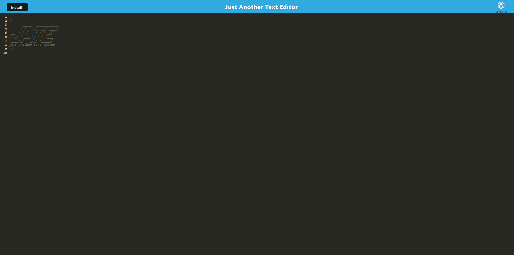

 # PWA-Text-Editor

## Description

This app features a text editor that runs within the browser, and additionally allows the app to be downloaded via PWA (Progressive Web Applications). The front-end code was provided to me, and I was tasked with ensuring the app is able to be downloaded properly, and that the PWA is setup correctly. Another feature the app contains is the ability to run while offline, and have data persist through the downloaded version and web version of the app.

## Table of Contents

- [Installation](#installation)
- [Usage](#usage)
- [Credits](#credits)
- [License](#license)
- [Questions](#questions)

## Installation

You can find the deployed app on Heroku at 

https://rb-pwa-text-editor-61229baba015.herokuapp.com/Links

## Usage

## Credits

Credit to my instructional teacher Gary Almes. Gary provided me with starter code to work off of for the project.

## License

This project is licensed under the MIT license. License link: https://opensource.org/license/mit/

## Questions

You can see below to reach me for any questions you have regarding the project.

https://github.com/rb2277

